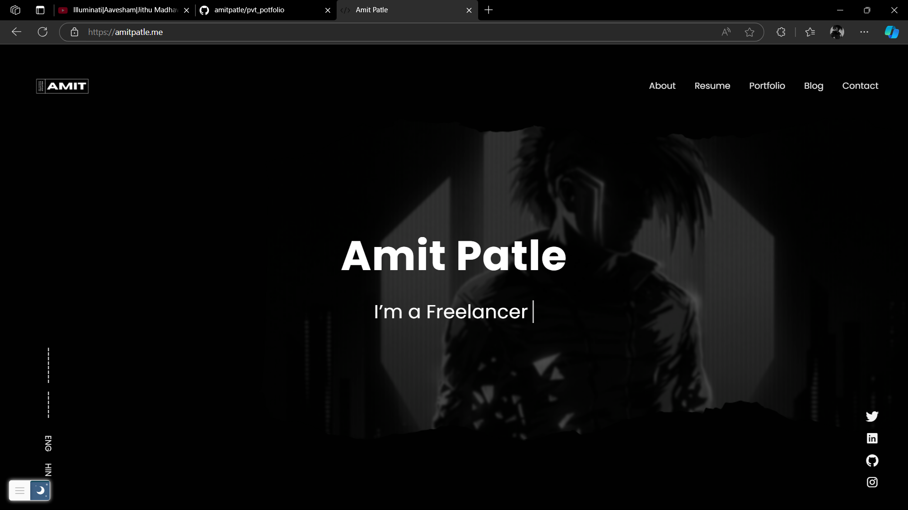

<div align="center">
  
# Amit Patle - Personal Portfolio Website

<a href="https://amitpatle.me"></a>
</div>
<br>


Welcome to my personal portfolio website! This site showcases my projects, skills, and background as a software developer and engineer. Feel free to explore my work and get in touch if you're interested in collaborating!

## Website Overview

The portfolio is designed to be simple, clean, and user-friendly, reflecting my aesthetic preference for optimized designs. The website includes the following sections:

- **About Me**: A brief introduction to who I am, my educational background, and my current work as a software engineer.
- **Projects**: Detailed descriptions of my open-source and personal projects, including:
  - Parking Lot Database Management System (Enforce)
  - Arduino NAS System
  - Fake Server on Raspberry Pi
  - Self-training AI Chatbot (in progress)
- **Skills**: A comprehensive list of the programming languages, tools, and frameworks I have expertise in, including Python, C/C++, JavaScript, React, MySQL, MongoDB, Docker, and more.
- **Contact**: Information on how to reach me via email or social media.

## Features

- **Responsive Design**: The website is fully responsive and works across all devices and screen sizes.
- **Optimized Code**: Built with performance in mind, without using Flexbox to ensure an optimized and clean design.
- **Interactive UI**: The site features an interactive, yet minimalist user interface that enhances the user experience.
  
## Technologies Used

- **Frontend**: HTML, CSS, JavaScript, React
- **Backend**: Node.js (optional, if applicable for your website)
- **Version Control**: Git, GitHub
- **Deployment**: (Add your preferred hosting service, e.g., GitHub Pages, Vercel, Netlify, etc.)

## How to Use

To explore the website, simply visit the link below:

[Portfolio Website URL](https://amitpatle.me) 

If you'd like to run the project locally, follow these steps:

1. Clone the repository:
    ```bash
    git clone https://github.com/yourusername/Portfolio-Site.git
    ```
2. Navigate to the project directory:
    ```bash
    cd Portfolio-Site
    ```
3. Install the required dependencies (if applicable):
    ```bash
    npm install
    ```
4. Start the development server:
    ```bash
    npm start
    ```
5. Open your browser and visit `http://localhost:3000` to view the website.

## Contact

Feel free to reach out to me if you have any questions or opportunities you'd like to discuss!

- **Email**: amitpatle@pm.me
- **LinkedIn**: [Amit Patle](https://www.linkedin.com/in/amitpatle) 
## License

This project is licensed under the MIT License - see the [LICENSE](LICENSE) file for details.
